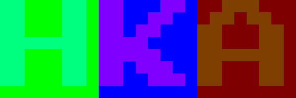
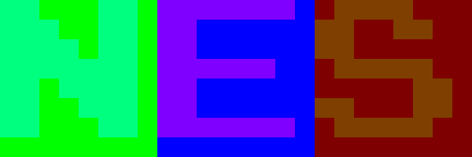
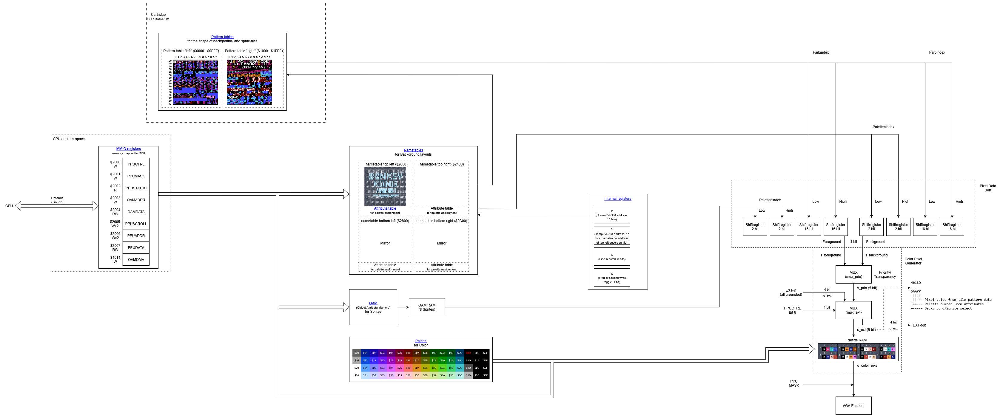
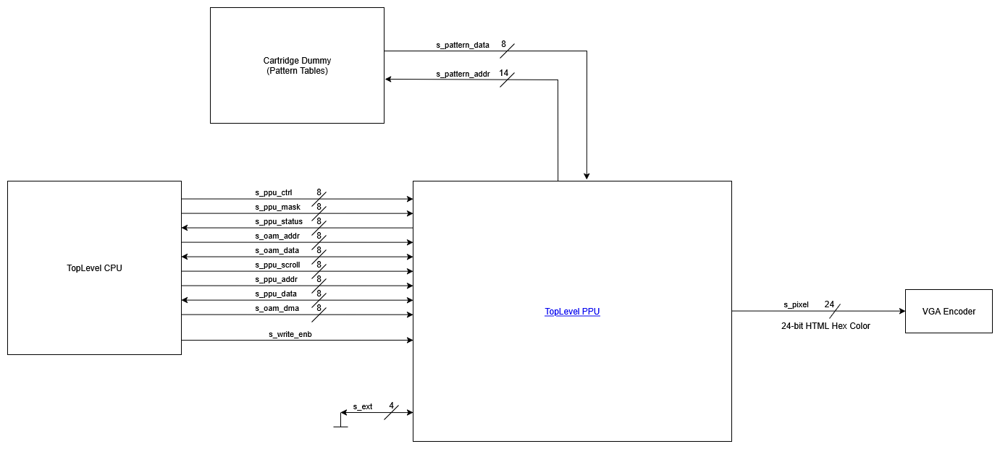
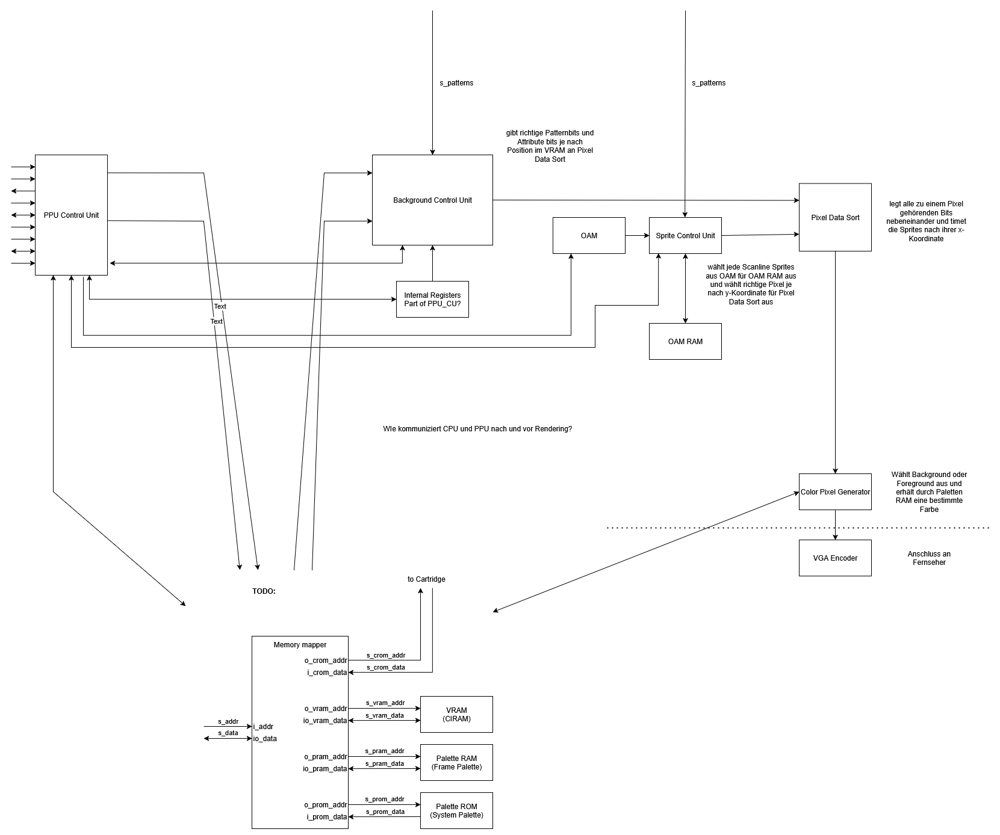

# HKA-NES

This project was created as a project assignment in the Electrical Engineering programme at [Karlsruhe University of Applied Sciences](https://www.h-ka.de/). The goal was to implement the Picture Processing Unit (PPU) of the NES on a FPGA using the hardware description language VHDL. The PPU gets inputs from the CPU and is also connected to the character ROM. In this way, it generates output data that can be interpreted as an image on a screen. Please note that this project only covers the PPU. Below is a brief overview of the modules used and their purpose.

### Motivation
The motivation for this project was to make VHDL more interesting and accessible to learners, to create a good resource for understanding the NES, and thus to contribute to the preservation of knowledge. This project is also intended to serve as the basis for a laboratory at our university and should also serve as a source for illustrating the coding standard and motivating our fellow students to learn more about the NES and VHDL.

We launched our own project for this purpose, as other implementations did not fully meet our requirements mentioned above. They were either too difficult to understand, based on Verilog instead of VHDL, were too close or too far from the original PPU, and did not have the academic background we needed.

### Goals
Our goal was therfore:
- to document the PPU as thoroughly as possible, so that students could understand it
- to implement the PPU in accordance with the university's coding standard
- to make minor adjustments so that it would work with modern hardware
- to generate at least one still image of a game

The goal was not to implement a fully functional NES, and currently there is no CPU available.

### Implementation
First, we tried to understand the PPU as well as possible. To do this, we created the [block diagram](#block-diagram) shown below. Based on this, we created blocks, each with a specific function, according to the principle of _"divide et impera"_, for example, a block that controls the background generation or a block that decides which pixels should be displayed. These can also be found below in the [VHDL entities](#vhdl-entities). We then began to implement these blocks from the end so that it was always clear which signal was to be generated. Each block has its own simulation to check that it is working correctly. During implementation, we tried to stay as close as possible to the original PPU. Nevertheless, we decided not to implement some parts for the time being. The following functions have not been implemented:
- the scroll function
- the Sprite-0 flag
- the sprite overflow error
- parts of the PPU-MASK function

The main reason for this was a lack of time, so we concentrated on the functions that are essential for generating a frame.

### Evaluation 
Have we achieved our goals? We have documented our work here with pictures, comments and explanations. We have also programmed in accordance with our university's coding standards. All essential PPU functions have been implemented, so we now have a functional PPU. However, as you have already read, the PPU does not correspond exactly to the original. We are also able to generate a still image. For a moving image, we would need to connect the CPU as well. We are satisfied with our result and consider it a success, even though there is still room for further implementation.

### Outlook
In future, you too could get involved and, for example, implement the above-mentioned functions that have not yet been implemented. A CPU must be connected for moving images, and a VGA or HDMI encoder is required to display an image on a television. The overall goal could be a fully implemented NES in which not only the PPU works, but also the other parts such as the CPU, APU, etc.

## Block diagram

## VHDL Entities

## PPU

### PPU Control Unit
Controls the PPU. Manages the MMIO registers through which the PPU communicates with the CPU.

### Sprite Control Unit:
This block is active while foreground rendering is enabled. Its purpose is to evaluate which sprites should be rendered in each scan line. For that it takes input from the OAM and compares the y-coordinate with the current scanline stored in the v-register. If a valid sprite is found, its data will be transferred to the OAM RAM (secondary OAM) and after that it will be loaded into the rendering shift registers.

### Background Control Unit:
This block is active while background rendering is enabled. Its purpose is to retrieve data from the name tables and load it into the rendering shift registers at the right time to ensure that the background is rendered correctly.

### Pixel Data Sort:
This block consists of the two subblocks `pixel_data_sort_background` and `pixel_data_sort_foreground`. Its purpose is to store the pixel data received from the background and foreground control units in shift registers, thereby converting the parallel data into serial data. These shift registers shift the data each cycle so that each cycle the data for one pixel drops out. The block is divided into those two subblocks because the background gets every 8 cycles newly fetched data input while the foreground is only evaluated once every scanline and the shifting starts depending on the sprite's x-coordinate. For that the subblock `countdown` is needed. `pixel_data_sort_foreground` consists of eight times the subblock `sprite_timer` because of readablity. The block used for the shift registers is called `shift_register_parallel_load`.

### Color Pixel Generator
Receives foreground and background data from `pixel_data_sort`. Decides whether foreground, background or backdrop is output. EXT functionality is fully supported. If it is the primary PPU (see EXT functionality of the PPU), the palette RAM is addressed and the colour pixel is output as an **HTML hex value**.

## Sources we used for development and which provide a good overview
- [NES dev reference guide](https://www.nesdev.org/wiki/NES_reference_guide)
- [NesHacker](https://www.youtube.com/@NesHacker)
- [An overview of NES rendering](https://austinmorlan.com/posts/nes_rendering_overview/)
- [fpgaNES from Feuerwerk](https://github.com/Feuerwerk/fpgaNES)
