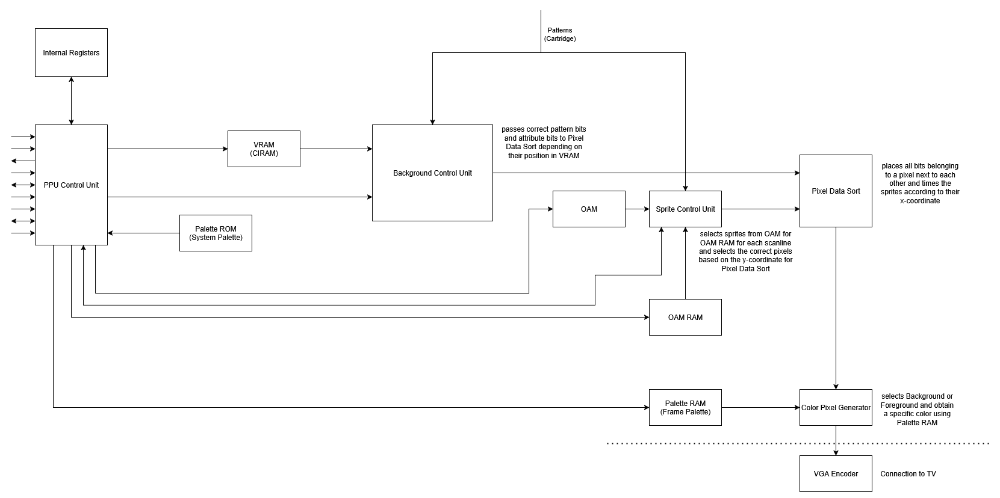

# HKA-NES

This project was created as a project assignment in the Electrical Engineering programme at [Karlsruhe University of Applied Sciences](https://www.h-ka.de/). The goal was to implement the Picture Processing Unit (PPU) of the NES on a FPGA using the hardware description language VHDL. The PPU gets inputs from the CPU and is also connected to the character ROM. In this way, it generates output data that can be interpreted as an image on a screen. Please note that this project only covers the PPU. Below is a brief overview of the modules used and their purpose.

## Blockdiagram

## VHDL Entities

## PPU

### PPU Control Unit
Controls the PPU. Manages the MMIO registers through which the PPU communicates with the CPU.

### Sprite Control Unit:
This block is active while foreground rendering is enabled. Its purpose is to evaluate which sprites should be rendered in each scan line. For that it takes input from the OAM and compares the y-coordinate with the current scanline stored in the v-register. If a valid sprite is found, its data will be transferred to the OAM RAM (secondary OAM) and after that it will be loaded into the rendering shift registers.

### Background Control Unit:
This block is active while background rendering is enabled. Its purpose is to retrieve data from the name tables and load it into the rendering shift registers at the right time to ensure that the background is rendered correctly.

### Pixel Data Sort:
This block consists of the two subblocks `pixel_data_sort_background` and `pixel_data_sort_foreground`. Its purpose is to store the pixel data received from the background and foreground control units in shift registers, thereby converting the parallel data into serial data. These shift registers shift the data each cycle so that each cycle the data for one pixel drops out. The block is divided into those two subblocks because the background gets every 8 cycles newly fetched data input while the foreground is only evaluated once every scanline and the shifting starts depending on the sprite's x-coordinate. For that the subblock `countdown` is needed. `pixel_data_sort_foreground` consists of eight times the subblock `sprite_timer` because of readablity. The block used for the shift registers is called `shift_register_parallel_load`.

### Color Pixel Generator
Receives foreground and background data from `pixel_data_sort`. Decides whether foreground, background or backdrop is output. EXT functionality is fully supported. If it is the primary PPU (see EXT functionality of the PPU), the palette RAM is addressed and the colour pixel is output as an **HTML hex value**.

## Sources we used for development and which provide a good overview
- [NES dev reference guide](https://www.nesdev.org/wiki/NES_reference_guide)
- [NesHacker](https://www.youtube.com/@NesHacker)
- [An overview of NES rendering](https://austinmorlan.com/posts/nes_rendering_overview/)
- [fpgaNES from Feuerwerk](https://github.com/Feuerwerk/fpgaNES)
